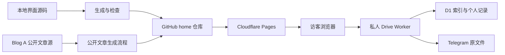

# LULIY 网站搭建、构建与维护指南

核对日期：2026-10-09。本文依据当前本地源码、发布脚本与配置整理；介绍现有工程，不代表本文所述本地修改已经部署上线。

## 1. 先理解三个不同的部分

| 部分 | 做什么 | 文件或数据在哪里 |
|---|---|---|
| 主站界面 | 首页、书房、作品、文章、唱片、关于、Drive 导航与交互 | 本地生成的 HTML 与 assets，发布到 GitHub 的 home 仓库，再由 Cloudflare Pages 展示 |
| 公开文章发布 | 独立文章、RSS、站点地图、分享信息 | Blog A 的公开 Gmeek 资料是来源；生成结果在 home 的 articles 等目录 |
| 私人网盘后台 | Telegram 登录、文件索引、读写、收藏与个人收录 | 单独的 tg-s3 Worker 工程；索引和记录在 D1，原文件在 Telegram |

它不是“每增加一个 HTML 就租一台服务器”。Cloudflare Pages 是托管静态文件的服务，Cloudflare 的基础设施负责向浏览器发送文件。你没有额外维护一台 VPS；Worker 也是单独的托管执行服务。GitHub 负责保存发布文件和版本记录。



公开网页、公开文章源和私人文件存储互相连接，但不能混为一个文件夹。Blog A、Blog B 是独立站点，本工程不负责重建它们。

## 2. 前端是怎样做出来的

主站使用 HTML、CSS 与 JavaScript，不以 React、Vue 或 Next.js 作为整站框架。页面导航使用浏览器 URL 的哈希部分，例如 `#/books`、`#/posts`、`#/music`、`#/drive`。切换栏目时，脚本更新正文区域，导航、主题和共享播放器继续使用同一个页面环境。

- HTML 提供内容容器、导航、按钮、弹窗及可访问名称。
- CSS 控制三主题、排版、响应布局、焦点、照片光影与动画。
- JavaScript 管理路由、文章读取、目录、图箱、文件管理及播放队列。
- Canvas 与 Three.js 用于星空、月面、书房和唱片机等画面。
- 音乐由一个共享音频实例驱动；紧凑卡片和唱片页读取同一份状态，而不是各自播放一首歌。
- 文件阅读器和元数据解析按需加载，避免首次打开网站就下载全部组件或私人原文件。

字体分工：英文主要使用 EB Garamond；中文、日文使用系统衬线字体；签名使用 Amalfi Coast；页名沿用现有 Times New Roman 设置。字体资源各自的授权条件分别适用。

签名的实现不是播放一段视频：先从字体生成精确字形 SVG，再准备书写轨迹。运行时用小画布逐笔显示轮廓，并缓存已经写完的字母。签名完成后，人物、门和楼梯在 y 的右下方柔和显现。减少动态效果时直接展示完成状态。

## 3. 主要源文件与生成结果

下列路径相对于本地工程根目录。它们是维护位置，不是网页里需要输入的地址。

| 文件或目录 | 用途 |
|---|---|
| `build-preview.py` | 主站本地生成入口，依次执行各个源模块的处理 |
| `ds-v2.css`、`polish-preview.py` | 基础设计与主要界面调整 |
| `patch-galaxy.py` | 星空／视觉相关的生成处理 |
| `reader-experience.py` | 文章阅读和唱片展示的生成处理 |
| `media-integration.py` | Drive、图箱、书房、唱片之间的联动 |
| `music-player.py` | 统一音乐队列和紧凑播放器的生成处理 |
| `site-release.py` | 发布前文本、静态资源、签名与网站说明等处理 |
| `site-colophon.js`、`site-colophon.css` | 网站说明页面的内容与布局 |
| `home-signature.*`、`footer-signature.*` | 首页、页尾签名的状态和样式 |
| `signature-renderer.*`、`signature-strokes.json` | 轻量逐笔绘制、装饰位置及提前生成的轨迹数据 |
| `brand-fonts/` | 构建时需要的字体源文件 |
| `luliy-drive*.js`、`luliy-media-library.js` | Drive、阅读器、缩略图与个人媒体联动逻辑 |
| `site-publish/generate.py` | 独立公开文章、RSS、索引的生成入口 |
| `package-drive.py` | 打包正式静态发布文件，排除后台凭据 |
| `tg-s3/src/`、`tg-s3/migrations/` | 私人网盘后端源码和数据库迁移，与静态主站分开 |

生成结果：

```text
preview/
  optimized.html             主站本地预览；打包后叫 index.html
  assets/site/               图片、字体与分享图
  assets/drive/              文档阅读、媒体解析等组件
  articles/P54/index.html    公开独立文章示例
  site-publish/              文章生成脚本和轻量样式
  .github/workflows/         公开文章的自动更新流程
  feed.xml                  RSS 订阅
  sitemap.xml               公开网址索引
  robots.txt                搜索服务读取提示
  public-articles.json       公开文章清单
  _headers                  静态资源缓存设置
  LULIY-建站与维护指南.md      本说明的下载文件
```

**当前界面构建有一个本机依赖：** `build-preview.py` 读取一份原始 HTML 快照，其路径仍写在脚本中，位于工程目录之外。换电脑时，必须带上这份快照并修改路径，或先把它纳入新的源工程。仅下载线上 home 仓库，不等于已经拿到完整的主站设计工程。公开文章生成脚本则已经随 home 仓库发布，可在 Actions 中独立运行。

## 4. 主站界面的完整构建流程

### 第一步：准备输入

保留原始 HTML 快照、源模块、图片字体、`assets/drive` 组件，以及已有公开文章发布文件。Python 构建入口使用 Pillow 处理图片。浏览器验证另用 Playwright 与 Chrome；它们不是访问网站的访客需要安装的工具。

不要把 `.env`、机器人 Token、Login Client Secret、Cloudflare 令牌或 `node_modules` 放进公开静态目录。网站只需要读取后台接口，不需要带着后台密钥访问。

### 第二步：修改对应源模块

例如改变网站说明就修改 `site-colophon.js`；改变音乐队列就修改播放器相关源模块；改变签名样式就修改签名源文件。

不要只修改生成后的 `preview/optimized.html`。下次重建会覆盖它，导致修改丢失。

### 第三步：执行主站生成

在工程根目录执行：

```powershell
python build-preview.py
```

当前顺序是：原始 HTML → 图片压缩及基础样式 → 星空处理 → 界面整理 → 阅读体验 → 媒体联动 → 音乐播放器 → 发布处理。

`site-release.py` 将部分内嵌图片、字体拆为 `assets/site/` 文件，并用内容摘要命名。相同内容复用同一文件名；内容变化会产生新文件名，方便浏览器识别更新。资源不是消失，而是从 HTML 里搬到独立文件，所以 HTML 会变小。

不要在同一生成文件上反复单独运行各个补丁脚本；部分步骤按固定输入替换，并不是可以无限重复执行的操作。正常更新从 `build-preview.py` 重新开始。

### 第四步：本机查看

可以直接打开 `preview/optimized.html` 查看基本布局。更接近部署环境的办法是在另一个终端运行：

```powershell
python -m http.server 8080 --directory preview
```

然后打开 `http://localhost:8080/optimized.html#/colophon`。这是本机临时预览服务，不是新增一台付费服务器；关闭终端就停止。某些需要正式 HTTPS 来源的 Telegram 授权流程，应在已配置的正式网站验证。

### 第五步：验收

检查桌面、手机、三主题、键盘、减少动态效果、路由返回与图片字体是否缺失；音乐检查播放、切歌、列表及跨栏目连续性；Drive 检查登录前为空、退出清理、文件限制与预览错误。

本地工程已有 `qa-home-signature.cjs`、`qa-footer-signature.cjs`、`qa-site-release.cjs` 等检查工具。它们包含当前电脑的浏览器工具路径，换电脑需要先调整。文章源网络故障与界面逻辑错误应区分，不能把缺失的网络内容当成已通过的验证。

### 第六步：打包

```powershell
python package-drive.py
```

得到 `LuliyDrive-更新包.zip`。打包将预览 HTML 改名为 `index.html`，同时带上资源、公开文章、自动更新脚本、索引和说明。`manifest.json` 保存文件摘要及发布标记。

当前打包脚本会读取本机后端配置检查是否意外包含敏感值，但不会把配置文件装入 ZIP。若换电脑没有该配置文件，需先调整打包检查的输入；不要为了打包去把密钥复制到静态网页。

## 5. GitHub 与 Cloudflare 怎样发布

本项目沿用 `luliyer6-ux/home` 的 GitHub → Cloudflare Pages 流程。

1. 先保留上一版更新包与提交号，明确本次发布范围。
2. 将新包解压到独立文件夹，核对 `index.html` 与资源齐全。
3. 将发布文件放到 home 仓库对应根目录，保留其他仍在使用的文件。
4. 检查差异后提交。Git 集成开启时，Cloudflare Pages 会因连接分支的新提交触发部署。
5. 在 Pages 部署列表看状态和对应提交号；成功后再访问 `https://luliy.me/` 检查，而不是只看 GitHub 上传成功。
6. 核对字体、图片、文档组件、文章、RSS、登录与播放。资源可能命中浏览器缓存，可用新标签或强制刷新作对比。

Pages 发布的是已经生成的静态结果，不会自动运行你电脑上的 `build-preview.py`。如果将来想在云端重新生成整个主站，需要先把全部输入与依赖纳入可复现的源仓库，不能直接让云端读取本机路径。

**发布时不要遗漏：** `assets/`、`articles/`、`site-publish/`、RSS 与索引、`_headers`、指南下载文件；自动文章更新还需要 `.github/workflows/public-articles.yml`。不要把 `tg-s3`、整个本地工程和历史预览都上传成公开静态文件。

出错时先识别是界面、文章数据还是后台问题；前端可回退 Git 提交或 Pages 历史部署。数据库不是前端的一部分，回退 HTML 不会自动回退 D1；涉及迁移时需要另行安排数据库备份和恢复。

## 6. 文章以后怎样新增和修改

### 日常写作

在 Blog A 原来的 Gmeek 文章源新增或编辑文章，等待原博客完成生成。主站读取公开文章资料，私人 Drive 的文件不会自动成为公开文章。

### 为什么有两种阅读网址

- `https://luliy.me/#/article/P54`：主站的互动画面，包含现有阅读功能和共享播放器。
- `https://luliy.me/articles/P54/`：独立静态文章；实际文件是仓库里的 `articles/P54/index.html`，适合分享与无需 JavaScript 的阅读。

`P54` 是文章身份，不能为好看而随列表排序重编号。新增文章用新的身份，旧文章的静态地址保持对应关系。

### 更新独立文章、RSS 与站点地图

`site-publish/generate.py` 读取公开的 `postList.json`，筛选出有效公开文章，再读取正文。它移除脚本、嵌入对象和事件属性等内容，重建目录、标准网址和分享元数据。

它的生成步骤与界面构建是独立的。重新运行 `build-preview.py` 本身不会重新抓取所有公开文章。需要主动更新时，在本地工程根目录运行：

```powershell
python site-publish/generate.py preview
```

或者在已发布的 home 仓库中打开 **Actions → Update public articles → Run workflow → main**。

当前工作流程设为 UTC 每日 22:17，即北京时间次日 06:17；也支持手动执行。排程不是保证精确到秒，需看实际运行记录。只有文件内容改变才提交；提交后的 Pages 部署还需要完成，静态阅读页才会更新。

来源读取失败或正文缺失会让生成失败，不会用空文章替换已生成的正文。生成脚本先准备完整临时结果，再写入发布目录；已在线的站点不会因本机失败而被自动覆盖。

因此主站文章列表和独立文章页可能短暂更新不同步：一边在浏览器读取公开数据，另一边依赖静态生成与部署。立即更新文章后，手动运行工作流程并检查 Pages 状态即可缩短这段差异。

## 7. Drive 后台的搭建顺序

以下说明部署步骤，本文并未重新执行部署或数据库修改。

1. 在 Telegram 准备机器人和目标存储聊天，按现有 tg-s3 项目说明配置权限及管理员。
2. 在 Cloudflare 准备 Worker 和 D1，将数据库绑定为工程要求的 `DB`。
3. 在 `tg-s3` 安装依赖，保留原有配置；先核对迁移列表、已有表和数据库备份，再应用需要的迁移，不能每次前端更新都重新初始化数据库。
4. 将需要保密的值配置为后台密钥。Bot Token 与 Telegram Login Client Secret 不是同一种凭据。
5. 在 BotFather 的 OpenID Connect 设置里登记正式网页来源与完整回调地址，回调的路径和来源必须与 Worker 登录实现对应。
6. 完成 Worker 类型检查与测试后，按该工程的部署流程发布。前端更新与后端发布分开安排。
7. 在正式 HTTPS 网站使用本人账号授权，验证管理员限制、过期和退出；用另一设备检查收藏、书签、阅读位置和私人收录。

当前设计里，D1 保存文件索引、会话及个人记录；文件身份使用 `(bucket, key)`；Telegram 保存原文件。签名文件地址有有效期，所以曲库保存稳定身份，而不是把临时下载链接当永久地址。

照片复用图箱，音乐复用共享播放器，私人书籍复用阅读器。“加入唱片／书房”是收录记录，不移动原文件。移出文件与尝试删除 Telegram 原消息是两种不同操作。网页上限目前为单文件 20MB，浏览器编码支持也会影响播放或预览。

## 8. 费用、资源和备份的实际含义

没有新增 VPS 或付费转换服务；R2 持久缓存在当前 `wrangler.toml` 中没有启用。关闭它不会删除 Telegram 原文件，但重新读取文件可能需要再次经过 Worker 和 Telegram。

“按免费额度设计”不等于所有服务永久无限，也不免除域名续费。Pages、Worker、D1、GitHub Actions 各自有计划和额度；是否产生费用还取决于账户计划与实际使用。增加一篇静态文章不是购买一台服务器。出现额度不足时应明确处理，不自动升级为付费方案。

公开静态资源都有网址，例如 `/assets/site/…` 的图片和字体、`/assets/drive/…` 的解析组件；它们不等于私人 Drive 原文件。旧版本资源可能为回退保留，清理前应检查是否仍被当前页面或旧部署引用。

备份至少区分：主站源工程、公开发布仓库、公开文章源、D1 记录，以及重要 Telegram 原文件。仅备份 ZIP，不一定保留完整的界面源工程；仅备份 GitHub，也不包含私人网盘全部原文件。

## 9. 常见维护问题

| 现象 | 先检查什么 |
|---|---|
| 字体改变、图像缺失 | HTML 是否引用了存在的指纹资源；是否完整上传 assets；字体是否真正加载 |
| DOCX／PDF 等阅读组件加载失败 | assets/drive 是否遗漏；请求是不是 404 或 HTML 错误页面 |
| 原博客已更新，独立文章仍旧 | Actions 是否执行成功；Pages 对应的新部署是否完成 |
| 网页能显示，但私人网盘打不开 | Worker、身份会话、来源配置和文件读取错误，不能只检查静态仓库 |
| 换电脑无法生成界面 | 原始 HTML 快照、源模块、字体、组件和构建依赖是否齐全 |
| 音乐列表不同步 | 点歌入口是否都使用共享队列；身份、来源和当前曲目是否一致 |
| 页尾动画卡顿 | 局部绘制与离屏停止是否生效；同一浏览器环境下区分签名和背景粒子的开销 |

## 10. 官方资料

- [Cloudflare Pages Git 集成与构建设置](https://developers.cloudflare.com/pages/get-started/git-integration/)：说明提交如何触发托管部署。
- [GitHub 手动运行工作流程](https://docs.github.com/en/actions/how-tos/manage-workflow-runs/manually-run-a-workflow)：说明 Run workflow 的使用条件。
- [Cloudflare Pages 平台限制](https://developers.cloudflare.com/pages/platform/limits/)：发布文件与部署额度以当前计划为准。
- [Cloudflare Workers 定价](https://developers.cloudflare.com/workers/platform/pricing/)与 [D1 定价](https://developers.cloudflare.com/d1/platform/pricing/)：核对当前后台额度。

网站说明入口是主站页脚的“網站說明”，地址 `#/colophon`；该页面保留既有图像来源和月面资料署名。本站不以文章、字体或音频的展示改变原作者及素材的权利归属。
